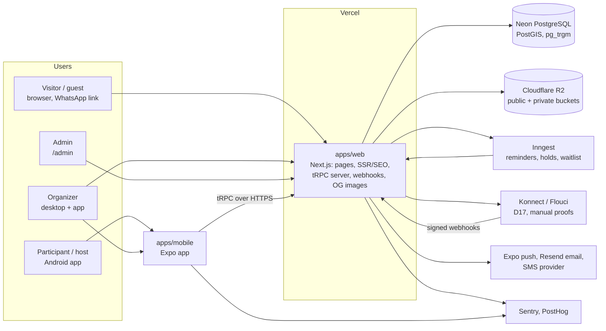
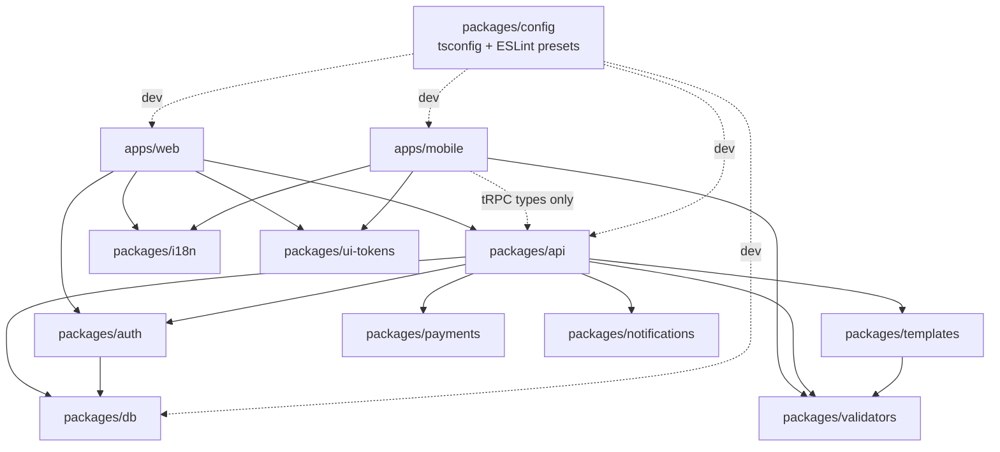
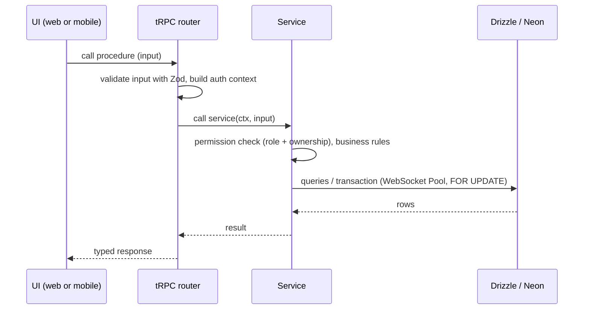

# Architecture

Doulisha is one TypeScript monorepo. It contains a Next.js web app, an Expo mobile app, and shared packages for the database, the API, auth, validation, translations, design tokens, templates, payments and notifications. Decisions and their reasons are recorded in [`decisions/`](decisions/README.md).

> Status: Phase 0. The apps and the tooling exist. Most packages are still empty and are filled in from Phase 1 onwards (see [`BUILD_PROMPT.md`](BUILD_PROMPT.md) section 8).

## 1. System context

## 2. Monorepo layout and dependencies

| Path                     | Responsibility                                                                                   |
| ------------------------ | ------------------------------------------------------------------------------------------------ |
| `apps/web`               | Public site, event pages (SSR), guest RSVP, organizer dashboard, `/admin`, tRPC server, webhooks |
| `apps/mobile`            | Expo app for participants, hosts and organizers, including QR check-in                           |
| `packages/db`            | Drizzle schema, SQL migrations, seed, query helpers                                              |
| `packages/api`           | tRPC routers (thin), services (business rules), permissions                                      |
| `packages/auth`          | Better Auth configuration shared by web and mobile                                               |
| `packages/validators`    | Zod schemas used on client and server                                                            |
| `packages/i18n`          | `ar` / `fr` / `en` messages, locale helpers, TND and date formatters                             |
| `packages/ui-tokens`     | Colours, spacing, radii and typography for Tailwind and NativeWind                               |
| `packages/templates`     | Category templates (model, wizard fields, brief, policy, modules)                                |
| `packages/payments`      | `PaymentProvider` interface: `mock`, `manual`, `konnect`, `flouci`                               |
| `packages/notifications` | Push, email and SMS adapters                                                                     |
| `packages/config`        | Shared `tsconfig` bases and ESLint presets (`base`, `next`, `expo`)                              |

Internal packages are published as TypeScript source (`exports: ./src/index.ts`). Each app compiles them itself (see ADR 0001).

## 3. Request layering

Rules:

- **Routers stay thin.** Anything with a business rule (capacity, waitlist, refunds, permissions) goes in a service, and every service is unit-tested.
- **Money** is stored as integer millimes (`*_millimes`). Times are `timestamptz`, displayed in `Africa/Tunis`.
- **Idempotency.** Payment webhooks, booking creation and notifications take idempotency keys.

## 4. Event engine (target, Phase 2)

There is one `events` table for every kind of event. Each event references a **template**, and the template picks one of the four models (A ticketed, B group trip, C private, D slot booking). Fields shared by every template are columns. Fields specific to a category live in `events.details` (JSONB), validated on write by the template's Zod schema from `packages/templates`. Admins edit templates as data (EVT-09).

## 5. Environments

| Environment  | Web                    | Database                       |
| ------------ | ---------------------- | ------------------------------ |
| Local        | `pnpm dev` (port 3000) | Neon dev branch (from Phase 1) |
| Pull request | Vercel preview         | Neon branch per PR, seeded     |
| Production   | Vercel                 | Neon `main` branch             |

The mobile app points to the local web server in development, and to the preview or production API through EAS build profiles (Phase 3).
