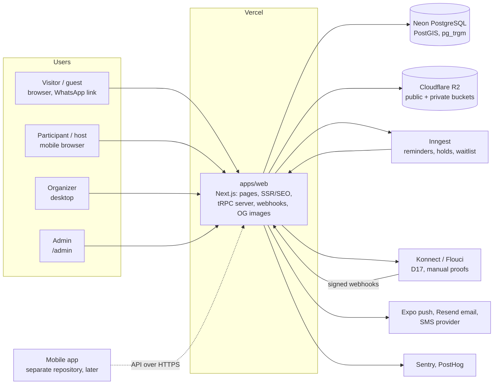
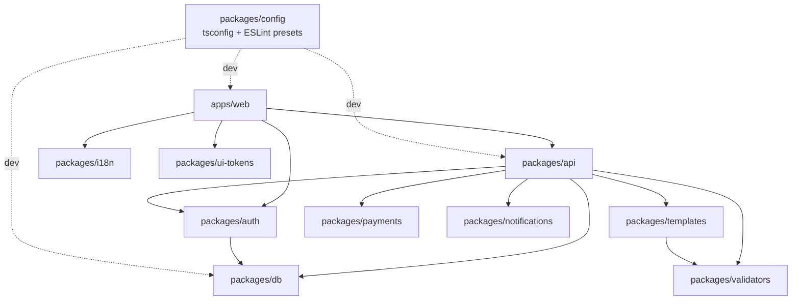
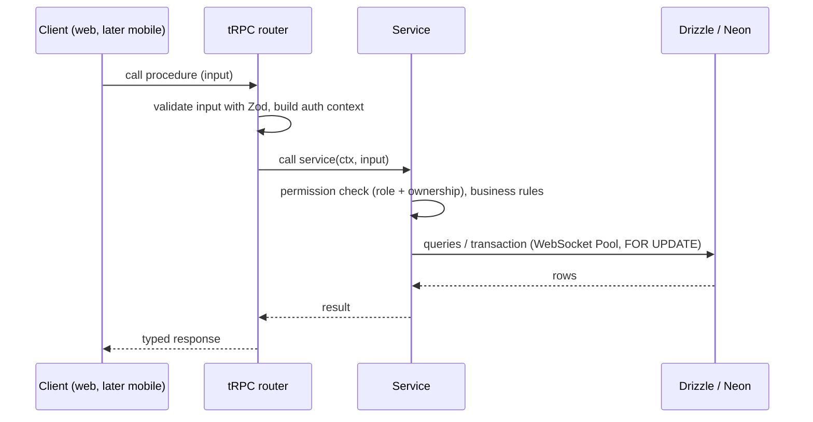

# Architecture

This repository is the Doulisha **web application**: a TypeScript monorepo with one Next.js app (which also serves the API) and internal packages for the database, the API, auth, validation, translations, design tokens, templates, payments and notifications. Decisions and their reasons are recorded in [`decisions/`](decisions/README.md).

The mobile app is a **separate project**, to be created later in its own repository (ADR 0006). It will call this app's API over HTTPS.

> Status: Phase 0. The apps and the tooling exist. Most packages are still empty and are filled in from Phase 1 onwards (see [`BUILD_PROMPT.md`](BUILD_PROMPT.md) section 8).

## 1. System context

## 2. Monorepo layout and dependencies

| Path                     | Responsibility                                                                                   |
| ------------------------ | ------------------------------------------------------------------------------------------------ |
| `apps/web`               | Public site, event pages (SSR), guest RSVP, organizer dashboard, `/admin`, tRPC server, webhooks |
| `packages/db`            | Drizzle schema, SQL migrations, seed, query helpers                                              |
| `packages/api`           | tRPC routers (thin), services (business rules), permissions                                      |
| `packages/auth`          | Better Auth server configuration (the future mobile app signs in through this API)               |
| `packages/validators`    | Zod schemas used on client and server                                                            |
| `packages/i18n`          | `ar` / `fr` / `en` messages, locale helpers, TND and date formatters                             |
| `packages/ui-tokens`     | Colours, spacing, radii and typography for Tailwind (framework-free, reusable by the mobile app) |
| `packages/templates`     | Category templates (model, wizard fields, brief, policy, modules)                                |
| `packages/payments`      | `PaymentProvider` interface: `mock`, `manual`, `konnect`, `flouci`                               |
| `packages/notifications` | Push, email and SMS adapters                                                                     |
| `packages/config`        | Shared `tsconfig` bases and ESLint presets (`base`, `next`)                                      |

Internal packages are published as TypeScript source (`exports: ./src/index.ts`), and Next.js compiles them (see ADR 0001).

Each package is a module with a clear boundary: payments, notifications, templates and so on. Keeping that boundary means a module can later be extracted into its own deployed service without rewriting its logic (ADR 0006).

## 3. Request layering

Rules:

- **Routers stay thin.** Anything with a business rule (capacity, waitlist, refunds, permissions) goes in a service, and every service is unit-tested.
- **Money** is stored as integer millimes (`*_millimes`). Times are `timestamptz`, displayed in `Africa/Tunis`.
- **Idempotency.** Payment webhooks, booking creation and notifications take idempotency keys.

## 4. Event engine (target, Phase 2)

There is one `events` table for every kind of event. Each event references a **template**, and the template picks one of the four models (A ticketed, B group trip, C private, D slot booking). Fields shared by every template are columns. Fields specific to a category live in `events.details` (JSONB), validated on write by the template's Zod schema from `packages/templates`. Admins edit templates as data (EVT-09).

## 5. Environments

| Environment  | Web                    | Database                               |
| ------------ | ---------------------- | -------------------------------------- |
| Local        | `pnpm dev` (port 3000) | Neon development branch (from Phase 1) |
| Pull request | Vercel preview         | Neon branch per PR, seeded             |
| Production   | Vercel                 | Neon `production` branch               |

### Neon project

- **Project:** `Doulisha` (`delicate-brook-47760427`), Postgres 18, region aws-us-east-2 (confirmed, OPEN_QUESTIONS Q9). Vercel functions run in `cle1` (Cleveland) so they sit next to the database.
- **Database:** `Doulisha`. The default branch is `production`.
- **Local link:** `neon link` stores the project and branch in `.neon` (gitignored). It also writes `DATABASE_URL` (pooled) and `DATABASE_URL_UNPOOLED` (direct, for migrations) to the root `.env.local` (gitignored).
- **Auth:** self-managed Better Auth, with its tables in our schema. Neon Managed Auth (`neon_auth`) is enabled on the branch but not used (Q10).
- **Extensions:** `postgis`, `pg_trgm` and `unaccent` are available on the branch and are enabled by the first migration in Phase 1.
