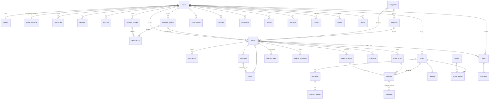

# Database

Doulisha stores everything in one **Neon PostgreSQL 18** database named `Doulisha`, accessed with **Drizzle ORM** from `packages/db` (ADR 0002).

## Conventions

| Rule            | How                                                                                                                                                                                |
| --------------- | ---------------------------------------------------------------------------------------------------------------------------------------------------------------------------------- |
| Primary keys    | `uuid` generated by Postgres 18's `uuidv7()` (time-sortable, ADR 0007). Better Auth is configured with `generateId: false`, so auth rows use the same ids.                         |
| Column names    | camelCase in TypeScript, snake_case in Postgres (`casing: 'snake_case'` in `drizzle()` and `drizzle.config.ts`).                                                                   |
| Money           | Integer **millimes** (1 TND = 1000 millimes), columns end in `Millimes` / `_millimes`. Never floats.                                                                               |
| Time            | `timestamptz` everywhere; displayed in `Africa/Tunis` by `@doulisha/i18n`.                                                                                                         |
| Phone numbers   | E.164 (`+21620123456`), normalized by `@doulisha/validators`.                                                                                                                      |
| Locations       | PostGIS `geography(Point, 4326)` (distances in metres), GiST-indexed.                                                                                                              |
| Soft delete     | `deleted_at` on user content (events, posts, comments, media, profiles of organizers and providers). Account deletion is a hard delete (cascades).                                 |
| Template fields | Common fields are columns on `events`; category fields live in `events.details` (JSONB), validated with the template's Zod schema (`buildDetailsSchema` in `@doulisha/templates`). |
| Indexes         | Every foreign key, `(status, starts_at)` on events, GiST on locations, trigram on `immutable_unaccent(lower(title))`.                                                              |

## Drivers: HTTP or WebSocket Pool

`@neondatabase/serverless` offers two drivers; `packages/db/src/client.ts` exposes both.

| Driver           | Function                             | Use for                                                                                                                                                                               |
| ---------------- | ------------------------------------ | ------------------------------------------------------------------------------------------------------------------------------------------------------------------------------------- |
| HTTP (`neon()`)  | `createHttpDb(url)`                  | Simple reads and single writes. One round trip per query, nothing to close. Used by the web app (`getDb()`), Better Auth and tRPC.                                                    |
| WebSocket `Pool` | `createPoolDb(url)` → `{ db, pool }` | Interactive transactions and `SELECT … FOR UPDATE`: bookings, payments, ticket stock (Phase 2), migrations and the seed. Create per request in serverless code and call `pool.end()`. |

Use the pooled URL (`DATABASE_URL`) at runtime and the direct URL (`DATABASE_URL_UNPOOLED`) for migrations.

## Branches and environments

| Branch           | Used by                                                                               |
| ---------------- | ------------------------------------------------------------------------------------- |
| `production`     | Production (Vercel). Migrated by the deploy pipeline; never seeded.                   |
| `dev`            | Local development (`.neon` and `.env.local` point here).                              |
| `preview/pr-<n>` | One per pull request, created by CI, migrated and seeded, deleted when the PR closes. |

`neon link` / `neon checkout` write the connection strings for the default `neondb` database; run `pnpm db:use-doulisha` afterwards (the code refuses `neondb` URLs).

## Migrations

```sh
pnpm db:generate            # drizzle-kit generate: SQL from schema changes (review it!)
pnpm db:migrate             # apply committed migrations (WebSocket Pool, direct URL)
pnpm --filter @doulisha/db exec drizzle-kit check   # CI: migrations consistent with the schema
```

- `0000_extensions.sql` (custom): `postgis`, `pg_trgm`, `unaccent` and the `immutable_unaccent()` wrapper needed for the accent-insensitive trigram index.
- `0001_init.sql`: all MVP tables. drizzle-kit quotes custom column types, so `geography(Point, 4326)` was unquoted by hand in this file; do the same if a new migration adds a geography column.
- `0002_event_audience.sql`: `events.audience` (`text[]`, "for whom" filter, DSC-02).
- Never run `drizzle-kit push` against production.

Stock changes (bookings, payments, cancellations) run in WebSocket `Pool` transactions that lock the event row first (ADR 0011). `pnpm --filter @doulisha/api test:integration` runs the 50-parallel-bookings test against the branch in `.env.local`.

## Seed

`pnpm db:seed` wipes the database (TRUNCATE … CASCADE) and inserts demo data in one transaction. It refuses to run when `NEON_BRANCH=production` unless `--force` is given. Dates are relative to the day it runs, so demo events stay upcoming.

Contents: 8 categories and 9 templates; 14 members (admin `+21620000001`, 5 organizers, 1 provider, 7 participants) and 1 guest; 5 organizer profiles and 2 provider listings; 13 events (hikes, a concert, workshops, sports, desert trips, a full show, a past event, a draft, a private birthday with invitations and RSVPs); orders in every payment state (paid, deposit with a D17 proof, cash pending, refunded) with bookings, attendees, payments, a proof and a refund; a small social graph. Event places counters include demo bookings that are not seeded one by one.

## Entity relationships (core)



## Tables

### Identity and social

| Table                                     | Purpose                                                                                                                                            |
| ----------------------------------------- | -------------------------------------------------------------------------------------------------------------------------------------------------- |
| `users`                                   | Better Auth users. Phone-only accounts get a `…@phone.doulisha.invalid` placeholder email; guests (`is_anonymous`) get `…@guest.doulisha.invalid`. |
| `sessions`, `accounts`, `auth_tokens`     | Better Auth sessions, linked OAuth accounts, OTP codes and magic-link tokens (`auth_tokens` is Better Auth's "verification" model).                |
| `user_roles`                              | ACC-05 multi-role: `organizer`, `provider`, `brand`, `admin`. Everyone is a participant; hosting needs no role.                                    |
| `profiles`                                | ACC-02 profile and ACC-06 privacy: visibility, who can invite me, who sees my attendance (default: friends).                                       |
| `profile_sensitive`                       | Emergency contact and encrypted medical notes, apart from the profile with strict access (spec section 8).                                         |
| `organizer_profiles`                      | ACC-03 clubs, associations, promoters; `verified_at` after ACC-04 approval.                                                                        |
| `provider_profiles`                       | PRV-01/02 directory: venues, catering, DJs… with a price range.                                                                                    |
| `verifications`                           | ACC-04 documents (ID, JORT, RNE, tourism licence) in the private bucket, reviewed by admins.                                                       |
| `notification_preferences`                | COM-04 per type and channel (UI in V1).                                                                                                            |
| `friendships`                             | SOC-02, one row per pair in either direction (unique on least/greatest).                                                                           |
| `follows`                                 | SOC-01 follow users, organizers or providers.                                                                                                      |
| `posts`, `comments`, `reactions`, `media` | SOC-04/05 event wall and feed; media are R2 object keys.                                                                                           |
| `reports`, `blocks`                       | TRS-03 reports (ADM-02 queue) and blocks.                                                                                                          |

### Events

| Table                               | Purpose                                                                                                                                                                    |
| ----------------------------------- | -------------------------------------------------------------------------------------------------------------------------------------------------------------------------- |
| `categories`                        | Spec 1.3 categories with ar/fr/en names, icon and accent token.                                                                                                            |
| `templates`                         | EVT-09 templates: model, wizard fields, default brief, policy, modules, filters (JSON `definition`). Seeded from `@doulisha/templates`, then edited by admins.             |
| `events`                            | One row per event of any model (ticketed, group trip, private, slot booking): visibility, status, dates, place, capacity, `places_taken`, price, brief, policy, `details`. |
| `occurrences`                       | Dates of an event (one in the MVP; recurring events in V1).                                                                                                                |
| `itinerary_steps`, `meeting_points` | EVT-06 programme and LOG-01 pick-up points.                                                                                                                                |
| `ticket_types`                      | TKT-02 types with price, optional deposit, stock and seats per ticket (couple = 2).                                                                                        |
| `booking_questions`                 | TKT-03 questions asked at booking.                                                                                                                                         |
| `invitations`, `rsvps`              | INV-02/03. Contacts are stored only as a salted hash; every RSVP has a user (guests get an anonymous one).                                                                 |
| `checklists`                        | LOG-03 (UI in V1).                                                                                                                                                         |

### Commerce

| Table                                                 | Purpose                                                                                                              |
| ----------------------------------------------------- | -------------------------------------------------------------------------------------------------------------------- |
| `orders`                                              | PAY-01 unified checkout: reference (`DLS-XXXXXX`), buyer, totals in millimes, status, idempotency key, UTM (SHR-04). |
| `bookings`                                            | Places held or confirmed per ticket type; holds expire (`hold_expires_at`), waitlist position (PRT-04).              |
| `attendees`                                           | PRT-01 one row per person with ticket code (QR) and check-in.                                                        |
| `payments`, `payment_proofs`                          | PAY-02 payments by provider and method; PRT-03 proofs of cash, transfer or D17.                                      |
| `refunds`                                             | PAY-04 refunds from the cancellation policy.                                                                         |
| `ledger_entries`                                      | Double-entry ledger; entries sharing a `transaction_id` must balance.                                                |
| `payouts`, `subscriptions`, `promo_codes`, `invoices` | PAY-06, ORG-02 and the trial, TKT-06, PAY-08 (VAT 19%). Flows arrive in later phases.                                |

V1 tables (communities, venues, slots, services, quotes, vehicles, gift pools, reviews, badges…) are created when their phase starts.
